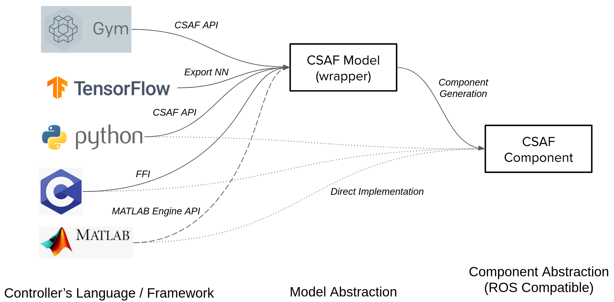
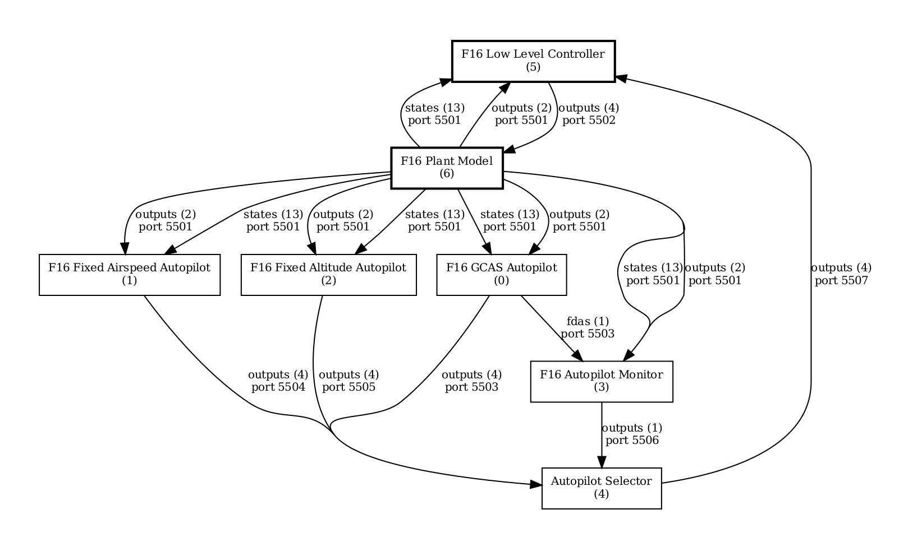
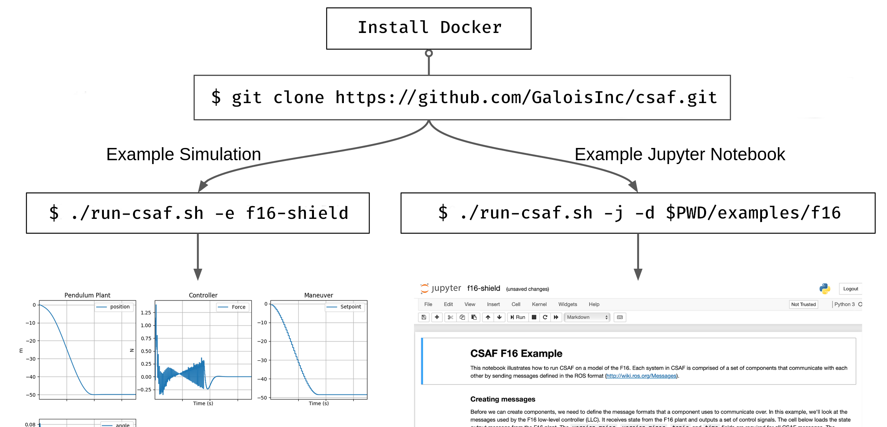

# Control Systems Analysis Framework (CSAF)


- [Quick Start](#quick-start)
- [Examples](#examples)
- [Jupyter notebooks](#jupyter-notebooks)
- [Job configuration](#job-configuration)
- [Development](#development)
- [Licensing](#licensing)
- [Acknowledgement](#acknwledgement)


CSAF is a framework to minimize the effort required to evaluate, implement, and **verify** controller design (classical and learning enabled) with respect to the system dynamics. Its key features are:

* Component based controller design
* Native support for python and C language executables
* Compatibility with external hardware and software processes
* Ease of deployment



Controllers, subsystems and plants are implemented as a collection of components.
Components communicate via a 0MQ pub/sub configuration and serialize/deserialize ROS messages. Below is an example of a topology graph of F16 system with GCAS autopilot.



## Quick Start

### Installation 
CSAF runs inside a [Docker container](https://www.docker.com/), and in order to use CSAF, you first need to [install docker](https://docs.docker.com/engine/install/). CSAF has been tested on Linux (Ubuntu 18.04 and 20.04) and OS X, but should run on any nix-like system that runs docker. CSAF can be also run natively on your host machine, but this option is recommended only for the developers and isn't officially supported.



### Running CSAF

Once you clone the main repository, `run-csaf.sh` is the entry point to the CSAF framework. For a simple start use `-e` flag and select one of the provided examples to run `f16-shield, f16-simple, f16-llc, inv-pendulum, ...` Note that the script has to be run from the CSAF root directory.

To get help, type `run-csaf.sh` from CSAF root directory:

```
./run-csaf.sh -h
CSAF
    Control System Analysis Framework (CSAF) is a middleware framework that
    makes creating and evaluating control systems as simple as possible. Control
    loop topologies and component implementations are specified independently of
    the middleware.

USAGE
   -e      the name of the example { f16-shield, f16-simple, f16-llc-analyze, f16-llc-nn, inv-pendulum }
   -c      the name of the model config file (must be in the same directory as your system)
   -d      fully qualified path to the directory defining the system
   -f      name of the job config file (must be in the same directory as your system)
   -j      launch a jupyter notebook
   -l      build the image locally
   -n      run CSAF natively
   -t      the tag of the image { stable, edge, latest }
   -h      prints the help menu
   -x      clear the output for a particular example/config

EXAMPLES
Run f16-simple example:
    ./run-csaf.sh -e f16-simple
Run f16-simple example natively (not in a docker container):
    ./run-csaf.sh -e f16-simple -n
Start a jupyter notebook with f16 example:
    ./run-csaf.sh -e f16-simple -j
    ./run-csaf.sh -e f16-shield -j
    ./run-csaf.sh -d ${PWD}/examples/f16 -j
Start jupyter notebook with your own example:
    ./run-csaf.sh -j -d ${PWD}/examples/inverted-pendulum
Run f16-shield with your own job config:
    ./run-csaf.sh -e f16-shield -f f16_job_conf.toml
Clear generated outputs for f16 example:
    ./run-csaf.sh -e f16-simple -x
```

### F-16 example

To see the F16 model with GCAS autopilot example in action, run the following command:

`./run-csaf.sh -e f16-shield`

Once the simulation completes, navigate to `examples/f16/output` to view the 
generated run:


Here's a quick glance at what's going on behind the scenes:
* The overall system and loop topology is defined in `examples/f16/f16_shield_config.toml`. This file
dictates which components are in the system and how they are connected together.
* Individual components are defined in `examples/f16/components`, where a component
consists of a configuration file and an implementation.
  * For example, the F16 plant
is defined by `examples/f16/components/f16plant.py` and 
`examples/f16/components/f16plant.toml`.
* The middleware message formats that
each component speaks are defined in the ROS message format. The F16 messages 
can be found in `examples/f16/components/msg`.


## Examples
CSAF currently contains a number of other examples, that are located in the `examples` directory.
Please read the [examples README.md](./examples/README.md) for a detailed list of the included examples,
containing important licensing and attribution information. 


## Jupyter notebooks

CSAF can be used from within a [jupyter notebook](https://jupyter-notebook.readthedocs.io/en/stable/examples/Notebook/What%20is%20the%20Jupyter%20Notebook.html#Introduction). To start CSAF in the notebook mode, run `./run-csaf.sh -j -e f16-simple` - the `-j` flag specified *notebook mode*, and using the `-e f16-simple` as an example will set the paths necessary for using the F16 model.

**NOTE:** notebooks are run inside docker, and because of that the directory paths are different than if they were run natively. Keep this in mind when writing new notebooks, and have a look at the provided examples in `docs/notebooks` directory.


## Job configuration

As an alternative to Jupyter notebooks, and to help with automating certain tasks, a *job configuration file* can be provided to `run-csaf.sh` (use `-f $NAME_OF_THE_JOB_CONFIG`). Job config uses TOML syntax, and can be used to specify initial conditions, timespan of the simulation, and plotting options. The list of supported parameter is expected to grow in the future. Below is an example of a simple job configuration file:

```toml
# simulation options
tspan = [0.0, 10.0]
show_status = true # show progress during simulation
plot = true # plot results on screen

initial_conditions = [  540.0,
                        0.037027160081059704,
                        0.0,
                        0.1,
                        -0.1,
                        -0.1,
                        0.0,
                        0.0,
                        0.0,
                        0.0,
                        0.0,
                        4800.0,
                        90.0]
```
This file is saved in the same directory as your system, in this case `examples/f16/f16_job_conf.toml` and could be used with `./run-csaf.sh -c ${PWD}/examples/f16/f16_shield_config.toml -f f16_job_conf.toml -d ${PWD}/examples/f16`

## Development
`CONTRIBUTING.md` contains CSAF development guildelines, please familiarize yourself with the guidelines before opening a pull request. The best way to contact the dev team is via gitlab issues.

## Licensing

The code in this repository is licensed under two different license. The core of CSAF (`src` and `docs` directories) is licensed under [BSD license](LICENSE.txt), the code in the `examples` directory is licensed under [GPL license](examples/LICENSE.txt)

## Acknowledgement
This material is based upon work supported by the DARPA Assured Autonomy program under the United States Air Force under Contract No. FA8750-19-C-0092. Any opinions, findings and conclusions or recommendations expressed in this material are those of the author(s) and do not necessarily reflect the views of DARPA or the United States Air Force.