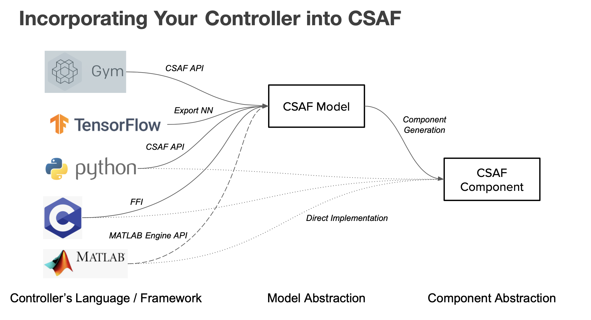
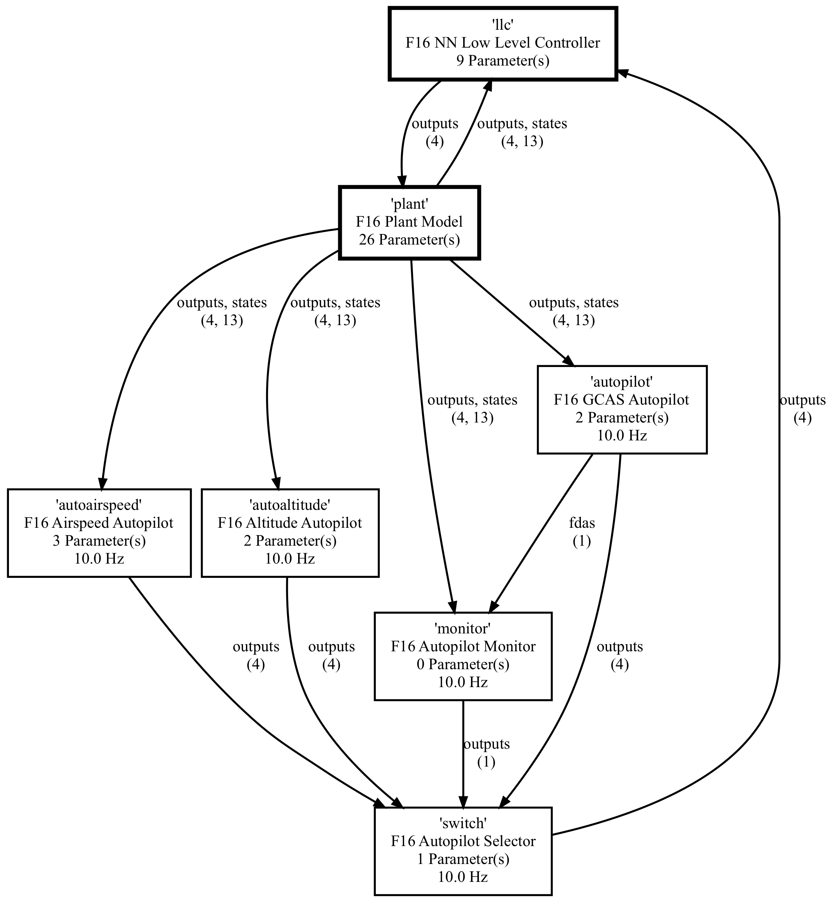
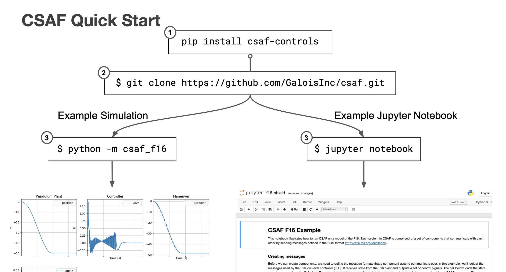
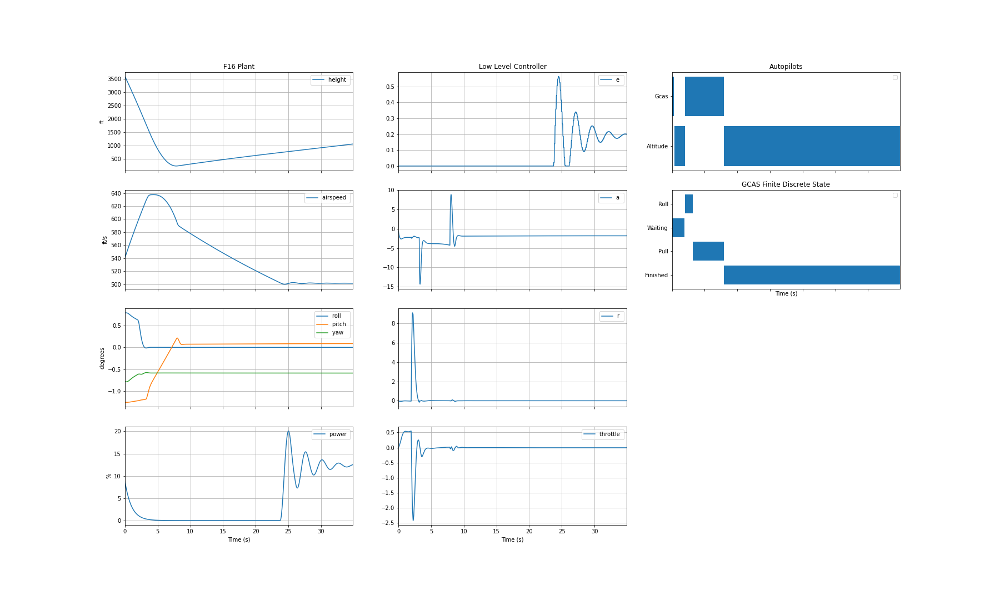

# Control Systems Analysis Framework (CSAF)


- [Quick Start](#quick-start)
- [Examples](#examples)
- [Jupyter notebooks](#jupyter-notebooks)
- [Job configuration](#job-configuration)
- [Development](#development)
- [Licensing](#licensing)
- [Acknowledgment](#acknowledgment)

CSAF is a framework to minimize the effort required to evaluate, implement, and **verify** controller design (classical and learning enabled) with respect to the system dynamics. Its key features are:

* Component based controller design
* Native support for python and C language executables
* Compatibility with external hardware and software processes
* Ease of deployment



Controllers, subsystems and plants are implemented as a collection of components.
Below is an example of a topology graph of F16 system with GCAS autopilot.



## Quick Start

### Installation



#### Native

Clone the repo, and install via `pip`,
```bash
pip install csaf
```

To install additional dependencies needed for the examples, go to the repo root and run
```bash
pip install -r requirements.txt
```

#### Docker

CSAF runs inside a [Docker container](https://www.docker.com/), and in order to use CSAF, you 
first need to [install docker](https://docs.docker.com/engine/install/). CSAF has been tested on Linux 
(Ubuntu 18.04 and 20.04) and OS X, but should run on any nix-like system that runs docker. 

At the repo root, build the docker image
```bash
docker build -t csaf .
```

Now you can run an example
```bash
docker run -v $PWD:/out csaf python -m csaf_f16 --output-dir /out
```

Alternatively, a jupyter instance can be launched
```bash
docker run -p 8888:8888 csaf jupyter notebook --allow-root
```

## Examples
CSAF currently contains a number of examples, including the F-16 shown below. These examples are packaged into component
libraries. These libraries have application entry-points for demonstration. Note that CSAF has utilities to generate these
entrypoints for user created component libraries. 

### F-16 Control System

To run a F16 system simulation, run
```
$ python -m csaf_f16 --time-max 30.0 --system F16Simple  
```



The library CLI options are
```
$ python -m csaf_f16 --help

F16 Components (CSAF Library)
usage: __main__.py [-h] [-s SYSTEM] [-o OUTPUT_DIR] [-t TIME_MAX] [-d DO_OPEN]

F16 Components (CSAF Library) CSAF F16 Systems Viewer

optional arguments:
  -h, --help            show this help message and exit
  -s SYSTEM, --system SYSTEM
                        CSAF System to Simulate (examples are ['F16Simple', 'F16AirspeedSimple', 'F16Shield', 'F16MultiAgentCentral', 'F16AcasShield',
                        'F16AcasIntruderBalloon', 'F16AcasShieldIntruderBalloon', 'F16AcasShieldAcasIntruderBalloon'])
  -o OUTPUT_DIR, --output-dir OUTPUT_DIR
                        Directory to Store Artifacts
  -t TIME_MAX, --time-max TIME_MAX
                        Timespan to Simulate
  -d DO_OPEN, --do-open DO_OPEN
                        Open Simulation Result
```

## Jupyter notebooks

CSAF can be used from within a [jupyter notebook](https://jupyter-notebook.readthedocs.io/en/stable/examples/Notebook/What%20is%20the%20Jupyter%20Notebook.html#Introduction). 
To start CSAF in the notebook mode, go to the `notebooks` folder and run
```python
jupyter notebook
```

## Tests

CSAF unit and integration tests use the pytest framework. After installing the [mypy plugin](https://pypi.org/project/pytest-mypy/),
static tests can be added by adding the switch
```python
pytest --mypy -s tests
```

## Development
`CONTRIBUTING.md` contains CSAF development guidelines, please familiarize yourself with the guidelines before opening a 
pull request. The best way to contact the dev team is via GitHub issues.

## Licensing

The code in this repository is licensed under two different licenses. The core of CSAF (`csaf` directory) and the majority of
examples is licensed under [BSD license](LICENSE.txt). The [f16 examples](csaf_f16) in the `csaf_f16` module is licensed under [GPL license](csaf_f16/LICENSE.txt).

## Acknowledgment
This material is based upon work supported by the DARPA Assured Autonomy program under the United States Air Force under Contract No. FA8750-19-C-0092. Any opinions, findings and conclusions or recommendations expressed in this material are those of the author(s) and do not necessarily reflect the views of DARPA or the United States Air Force.
