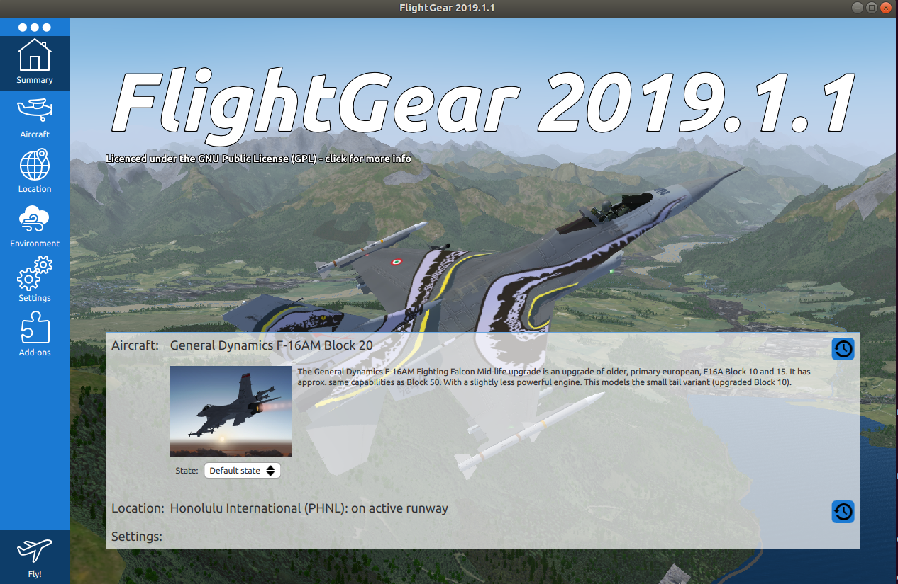
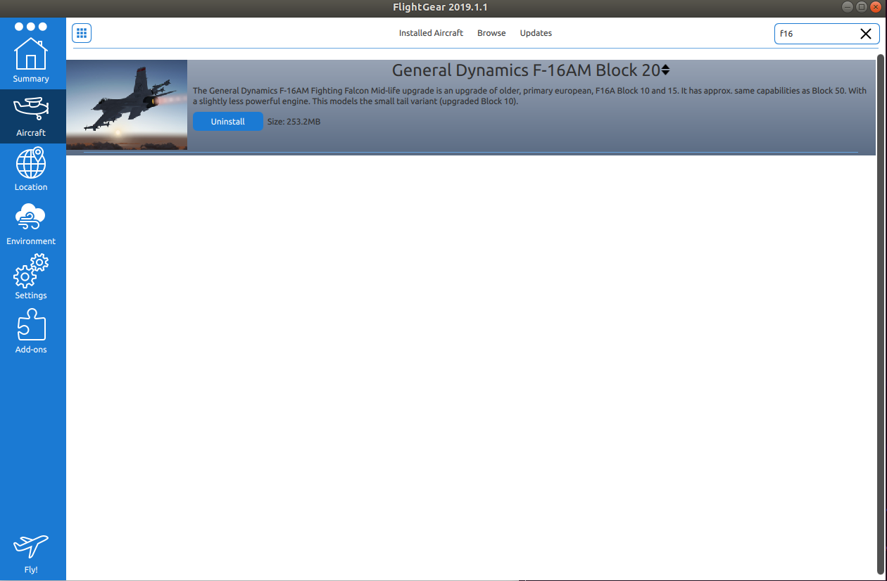

# Flight Gear

## Install flightgear

FlightGear can be installed in Ubuntu via the provided install script:

```
$ cd examples/f16/flightgear
$ sudo ./install_fg.sh
```

If you are installing on MacOS or Windows, please follow the installation instructions online: https://www.flightgear.org/download/main-program/

Please note that we support Flightgear + CSAF only on Ubuntu.

## Install aircfraft model

Open flight gear Qt launcher:

```
fgfs --launcher
```

You will see a lancher similar to the one below:



On the left side, click on the *Aircraft* icon, and install the default hangar.  When the default hangar is installed,
in the search box type "f16". Install "General Dynamics F16" - when it is installed, it should look like in the picture below:



You can now close the launcher.

## Run Flight gear

Prior to running any simulation, start FlightGear by:

```
./scripts/launch_fg.sh
```

This will launch flightgear with the correct port number assigned.


## Under the hood

If you cannot use our install script and need to install Flightgear manually, these are the steps: 

### Linux packages

For Ubuntu:
```
sudo add-apt-repository ppa:saiarcot895/flightgear
sudo apt-get update
sudo apt install flightgear recordmydesktop
```

### Install generic protocol file
Because the F16 model included in Flight Gear has some nonstandard mapping of the control inputs, we have to control it over [generic protocol](http://wiki.flightgear.org/Generic_protocol). [This](https://forum.flightgear.org/viewtopic.php?f=4&t=2003&start=315) forum post explains which are the properties of interest. We have to copy `scripts/f16.xml` into the [$FG_ROOT](http://wiki.flightgear.org/$FG_ROOT) directory:

```
ln -s f16.xml $FG_ROOT/Protocol/f16.xml
```

### Download scenery

Sometimes [Terrasync](http://wiki.flightgear.org/TerraSync) server is not available, in which case you have to download scenery manually. Use this [Graphical Inerface](http://ns334561.ip-5-196-65.eu/~fgscenery/WS2.0/scenery-2.0.1.html) to select appropriate tile, based on your location.
